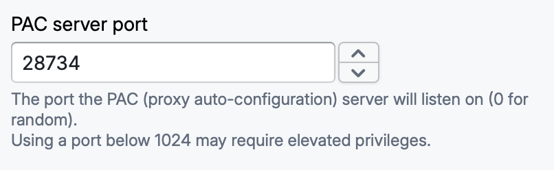
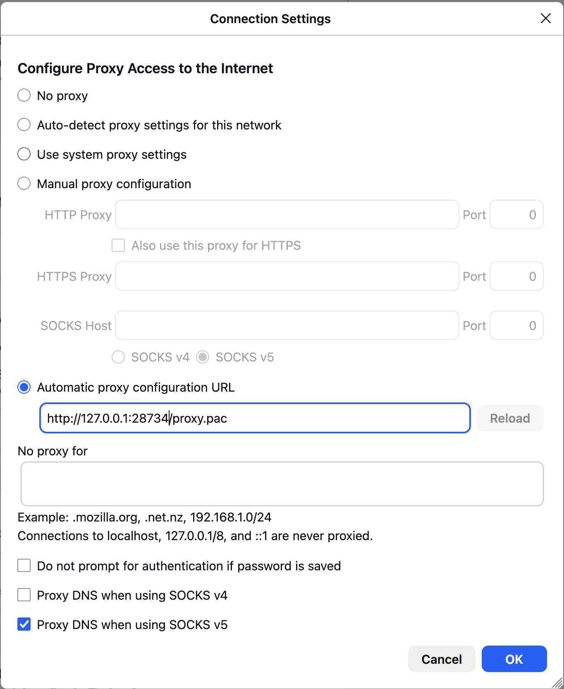

On Linux, Zen can only automatically configure the system proxy on GNOME and KDE. On other desktop environments, you might need to do so manually.

First, set the PAC server port in Zen's settings so it can be configured in applications later:

1. In Zen, go to **Settings** and scroll to **PAC server port**.
2. Set it to a fixed value (e.g., `28734`).



Then set the PAC proxy address in the settings of an application you want to use with Zen. For applications that are not listed in this article, searching for "PAC proxy configuration <application-name>" in a search engine of your choice should yield a result.

> [!TIP]
> For applications that do not support PAC proxy configuration but do support setting a regular HTTP/HTTPS proxy address, use the "Proxy port" setting in Zen.

## Firefox

1. In Firefox, enter `about:preferences#connectionSecurity` into the address bar and press Enter.
2. Go to **Configure proxy** (under Proxy settings).
3. Select **Automatic proxy configuration URL** and enter this value:
   ```
   http://127.0.0.1:<port-number>/proxy.pac
   ```
   where `<port-number>` is the port you set in Zen earlier.
4. Press **OK**.







## Chrome

Chrome does not have a UI setting for the PAC server address on Linux - it relies on the system proxy settings. Instead, launch it with the `--proxy-pac-url` command-line option:

```
google-chrome --proxy-pac-url="http://127.0.0.1:<port-number>/proxy.pac"
```

where `<port-number>` is the port you set in Zen earlier.

If you want this to be permanent, add the option to Chrome's `.desktop` file so that it also applies when you launch Chrome from the application menu.
