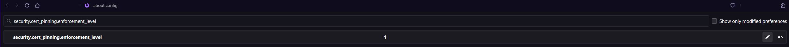
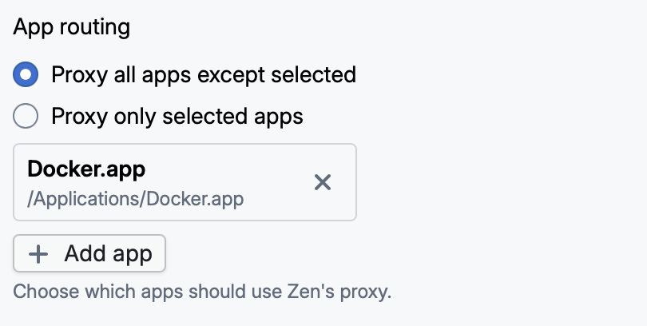

Learn how to diagnose and resolve common issues in Zen.

## Firefox

### `MOZILLA_PKIX_ERROR_KEY_PINNING_FAILURE`

If you're using Firefox with a non-standard configuration, such as Arkenfox, you may encounter a "Secure Connection Failed" screen with the error code `MOZILLA_PKIX_ERROR_KEY_PINNING_FAILURE`.

To work around this, set `security.cert_pinning.enforcement_level` in `about:config` to 1:



If you're using Arkenfox, you can add this preference to your `user-overrides.js`:

```js
user_pref("security.cert_pinning.enforcement_level", 1);
```

### `MOZILLA_PKIX_ERROR_MITM_DETECTED`

Another error that you may encounter in Firefox, especially right after installing Zen, is `MOZILLA_PKIX_ERROR_MITM_DETECTED`.

In most cases, the error is fixed by a **browser restart**.

If that doesn't resolve the issue, in Firefox, go to `Settings` > `Privacy & Security`, then scroll down to `Certificates`. Once there, tick the checkbox for "Allow Firefox to automatically trust third-party root certificates you install".

Alternatively, set `security.enterprise_roots.enabled` to `true` in `about:config` and restart Firefox. This appears to have the same effect as the setting explained above, according to the Firefox docs. However, it's good to check both just in case.

## Docker

When Zen is enabled, Docker automatically picks up the system proxy settings and routes container HTTP/HTTPS traffic through Zen. However, this can cause certificate verification errors because containers do not trust Zen's CA.

Fixing this issue comes down to excluding Docker from proxying.

### macOS

In Zen, go to `Settings` and scroll down to `App routing`. Ensure that "Proxy all apps except selected" is selected, click "+ Add app", and select `/Applications/Docker.app`. Here's how the setting should look as a result:


